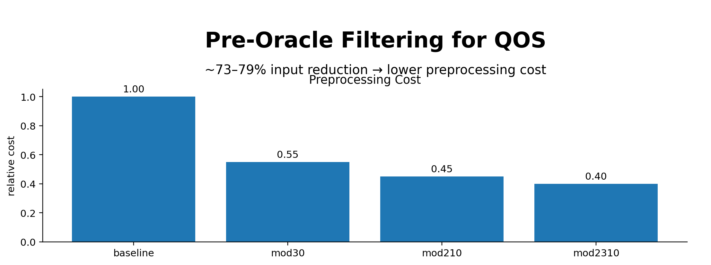

# Quantum Oracle Sketching (QOS)

Code repository for our paper ["Exponential quantum advantage in processing massive classical data"](https://arxiv.org/abs/2604.07639).

In this work, we introduce **Quantum Oracle Sketching**, a framework that enables access to the classical world in quantum superposition for large-scale machine learning.

See the blog post at [Quantum Frontiers](https://quantumfrontiers.com/2026/04/09/unleashing-the-advantage-of-quantum-ai/) for an introduction.

This repo contains:
- Core implementations of **quantum oracle sketching** in JAX.
- A tutorial that walk you through the basic usage of quantum oracle sketching.
- JAX implementation of quantum singular value transform (QSVT), including amplitude amplification, inversion, threshold, etc.
- A benchmark suite for quantum oracle and state sketching.
- Real-dataset experiments (classification and dimension reduction) for demonstrating the exponential memory advantage.

## Overview

**Quantum oracle sketching (QOS)** is a quantum algorithm for loading classical data into a quantum computer.
It instantiates the oracles needed by any quantum query algorithm using only random classical samples, with no full-dataset memory overhead.

This codebase includes two QOS simulation modes:
- `qos_sampling.py`: active random sampling implementation (more direct, heavier in simulation).
- `qos.py`: expected-unitary implementation (used for efficient benchmarking; conservative error upper bound).

They are implemented in JAX, which supports GPU/TPU execution and automatic differentiation.

## Quick Start

### 1) Environment

```bash
python -m venv .venv
source .venv/bin/activate
pip install --upgrade pip
pip install -r requirements.txt
```

Notes:
- `utils.py` enables 64-bit JAX (`jax_enable_x64=True`).
- `json` is part of the Python standard library, so it is not listed in `requirements.txt`.
- If you want GPU JAX wheels, install JAX following official JAX instructions for your CUDA/TPU setup.

### 2) Tutorial: Interactive Notebook

If you want to play with QOS directly (instead of reproducing full paper figures), start with:

- `notebooks/01_qos_quickstart.ipynb`
  - Minimal, step-by-step examples for core QOS primitives.
  - Walkthrough for QOS on Boolean functions, general vectors, and matrix-element oracles.
  - Includes error-vs-samples scaling with fitted exponent.

Open Jupyter from repo root:

```bash
jupyter lab
```

If Jupyter is missing in your environment:

```bash
pip install jupyterlab ipykernel
```

### 3) Run the synthetic benchmark (main benchmark figure generation)

From repo root:

```bash
python benchmark.py
```

This generates:
- `benchmark_flat_vector.pdf`
- `benchmark_general_vector.pdf`
- `benchmark_boolean_function.pdf`
- `benchmark_matrix_element.pdf`
- `benchmark_matrix_row_index.pdf`

## Repository Structure

```text
.
├── benchmark.py              # Main benchmark used in the paper
├── data_generation.py        # Random sample generators for vectors/matrices/boolean functions
├── primitives.py             # Shared quantum primitives (e.g., amplitude amplification)
├── qos.py                    # QOS via expected unitaries (main benchmarking path)
├── qos_sampling.py           # QOS via explicit random sampling
├── qsvt.py                   # QSVT utilities + phase generation via pyqsp
├── utils.py                  # Numerical helpers, random instances, block-encoding helpers
├── notebooks/
│   └── 01_qos_quickstart.ipynb # Beginner tutorial notebook
├── real_datasets/            # Real-data experiments + plotting scripts
│   ├── *_svm.py              # LS-SVM-style classification accuracy vs machine size
│   ├── *_pca.py              # PCA variance recovery vs machine size
│   ├── *_combine_fig.py      # Combined 2-panel plots for each dataset
│   └── *_size_vs_*.json/.pdf # Outputs generated by running dataset scripts
└── requirements.txt
```

## Real-Dataset Experiments

`real_datasets/` evaluates machine-size vs performance under feature truncation (via `min_df` or `min_samples`), for:
- IMDb sentiment (text TF-IDF)
- 20 Newsgroups topic data (text TF-IDF)
- PBMC68k single-cell RNA (UMI)
- Dorothea drug-discovery dataset
- Splice dataset (k-mer)

### Run full pipelines from scratch

Run from `real_datasets/` so relative paths and defaults match script expectations.

IMDb:
```bash
python imdb_svm.py
python imdb_pca.py
python imdb_combine_fig.py
```

20 Newsgroups (default averages over 100 random category pairs):
```bash
python 20news_svm.py --n_pairs 100
python 20news_pca.py --n_pairs 100
python 20news_combine_fig.py
```

PBMC68k:
```bash
python pbmc68k_svm.py
python pbmc68k_pca.py
python pbmc68k_combine_fig.py
```

Dorothea:
```bash
python dorothea_svm.py
python dorothea_pca.py
python dorothea_combine_fig.py
```

Splice:
```bash
python splice_svm.py
python splice_pca.py
python splice_combine_fig.py
```

### Dataset source/setup notes

- IMDb: auto-downloaded by `imdb_utils.py` from Stanford ACL IMDb.
- 20 Newsgroups: fetched through `sklearn.datasets.fetch_20newsgroups`.
- PBMC68k: loaded via `scvelo.datasets.pbmc68k` (downloaded/cached automatically).
- Dorothea: download manually from UCI (https://archive.ics.uci.edu/static/public/169/dorothea.zip) and extract to `data_cache/dorothea` (relative to where you run scripts).
- Splice: fetched via `ucimlrepo` (dataset id 69).

## Core Files and Roles

- `data_generation.py`: sampling interfaces (`vector_data`, `matrix_data`, `boolean_data`).
- `qos_sampling.py`: explicit sampled-gate assembly; includes oracle/state tests under sampling.
- `qos.py`: expected-unitary assembly (used by `benchmark.py`).
- `qsvt.py`: polynomial angle generation + QSVT application helpers.
- `primitives.py`: amplitude amplification and related utilities.
- `utils.py`: random instance generators, block-encoding helpers, fidelity/infidelity utilities.

## Reproducibility Notes

- Random seeds are fixed in scripts (`np.random.seed(42)` or JAX keys).
- Some full runs are heavy (large sample sweeps and repeated CV/SVD); expect long runtimes.
- Running `qos.py` or `qos_sampling.py` directly executes built-in tests with large default sizes.

## Citation

If you find this repository useful, please consider citing our paper.

```
@article{zhao2026exponential,
    title={Exponential quantum advantage in processing massive classical data},
    author={Haimeng Zhao and Alexander Zlokapa and Hartmut Neven and Ryan Babbush and John Preskill and Jarrod R. McClean and Hsin-Yuan Huang},
    journal={},
    eprint={2604.07639},
    archivePrefix={arXiv},
    year={2026}
}
```
## Optional: Wheel-Based Pre-Oracle Filtering

This fork adds a classical pre-processing layer before quantum oracle sketching.

The idea:
- apply modular “wheel” filters (mod30, mod210, mod2310)
- reduce candidate stream before oracle construction

Pipeline:

```text
raw classical data
→ wheel filter (this fork)
→ QOS sampling / sketching
→ quantum oracle
```

---

## Notebooks

For full experiments, figures, and paper-ready results, see:

👉 [notebooks/README.md](notebooks/modwheel_notebooks_overview.md)

Includes:

- Notebook 01 — wheel density and tradeoff  
- Notebook 02 — synthetic row-ID adapter  
- Notebook 03 — 20news real dataset adapter  
- Notebook 04 — consolidated paper figure pack  
- Notebook 05 — comparison with random subsampling  
- Notebook 06 — QOS-style wrapper (pre-feature filtering)  
- Notebook 07 — row-order robustness  

Together these show:

- ~73–79% candidate reduction  
- behavior comparable to random subsampling  
- reduced preprocessing cost (TF-IDF, etc.)  
- stability under dataset reordering  

---

## Paper

Full write-up of the modwheel pre-oracle filtering layer:

👉 [paper/paper.pdf](paper/paper.pdf)

Highlights:

- ~73–79% candidate reduction before oracle construction  
- deterministic alternative to random subsampling  
- reduced preprocessing cost in QOS-style wrapper experiments  
- robustness to dataset ordering  
- non-invasive integration (no QOS modifications)  

This work positions modwheel filtering as a:

> deterministic front-end layer for reducing classical input in QOS-style pipelines
