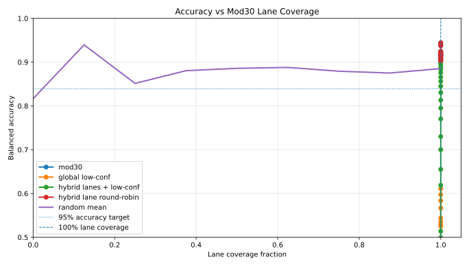
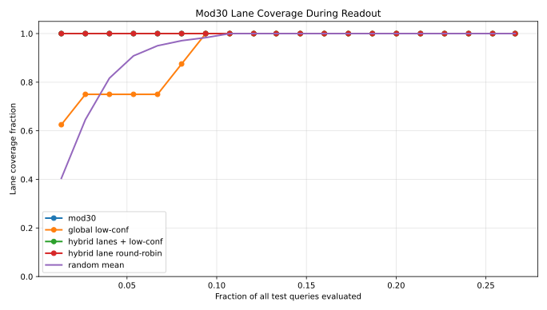
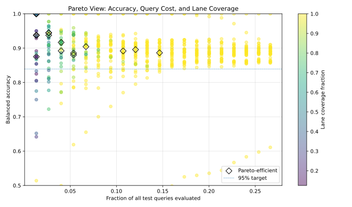

# Structured Readout Scheduling and Policy Design for Sparse Query Evaluation

## Abstract

Evaluating large numbers of sparse test queries is a bottleneck in data-intensive and hybrid workflows. While prior work emphasizes input reduction and model construction, less attention has been given to how inference itself is structured.

We introduce a framework for structured readout scheduling, coverage-aware inference, and multi-objective policy design. We show that predictive performance typically saturates before full coverage is achieved, that enforcing coverage constraints introduces a controllable evaluation cost, and that no single scheduling strategy dominates across all objectives. Pareto-efficient policies characterize optimal tradeoffs between query cost, predictive behavior, coverage, and distributional stability.

This work does not modify Quantum Oracle Sketching (QOS) or claim quantum advantage; it develops a classical inference-control layer compatible with QOS-style pipelines and other sparse evaluation settings.

---

## 1. Introduction

Many modern systems must evaluate large sets of candidate queries under limited computational budgets. This arises in machine learning inference, retrieval systems, and hybrid classical–quantum workflows such as QOS.

Most optimization effort has focused on:

- reducing input size  
- improving model construction  

We instead focus on:

> how to evaluate many sparse queries efficiently and systematically.

We propose that readout is not passive—it is a controllable component.

---

## 2. Problem Setting

We consider:

trained model → large query set → partial evaluation

At each step:

- predictions are computed  
- accuracy is measured  
- distributional properties evolve  

We control:

- query ordering  
- stopping rules  
- coverage  
- optimization objectives  

---

## 3. Readout Scheduling

### 3.1 Random

Uniform random selection; unbiased but unstructured.

### 3.2 Modular Scheduling (mod30)

Partition queries via:

i → i mod M

Provides deterministic structure and reproducibility.

### 3.3 Confidence Scheduling

Prioritize queries based on model uncertainty.

### 3.4 Hybrid Scheduling

Combine modular structure + confidence:

- partition into lanes  
- sort within lanes  
- interleave  

---

## 4. Early Stopping and Coverage

### Accuracy-only stopping

Stop when:

accuracy ≥ threshold

### Coverage

Coverage = fraction of modular lanes visited

### Coverage-constrained stopping

Stop when:

accuracy ≥ threshold AND coverage ≥ threshold

---

## 5. Experiments

### 5.1 Accuracy vs Coverage

Accuracy rises quickly and saturates before coverage completes.

---

### 5.2 Hybrid Scheduling Coverage

Hybrid scheduling improves structured coverage across lanes.

---

### 5.3 Pareto Frontier

Pareto-efficient policies reveal tradeoffs between query cost, accuracy, and coverage.

---

## 6. Multi-Objective Policy Design

We define costs:

- query fraction  
- accuracy gap  
- coverage gap  
- class distribution shift  

We optimize weighted combinations and identify Pareto-efficient policies.

---

## 7. Results

Key observations:

- accuracy saturates early  
- coverage requires additional queries  
- hybrid strategies balance tradeoffs  
- no universal best policy exists  

---

## 8. Discussion

This reframes inference as a policy design problem.

Key implications:

- evaluation can be structured  
- stopping requires explicit criteria  
- tradeoffs are unavoidable  

---

## 9. Relation to QOS

This framework is compatible with QOS:

input → model → structured readout

No modification to QOS internals is required.

---

## 10. Limitations

- dataset-dependent behavior  
- simple modular structure  
- confidence approximations  

---

## 11. Conclusion

We introduced:

- structured scheduling  
- coverage-aware stopping  
- multi-objective policy design  

This enables controlled inference in sparse evaluation settings.

---
