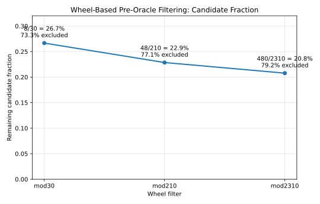
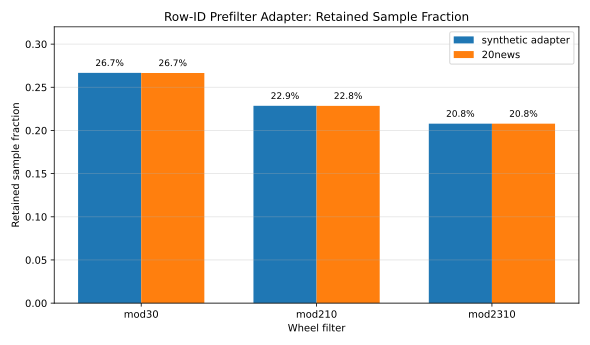
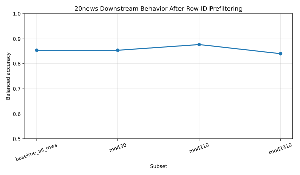
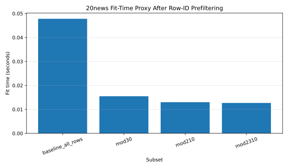

# Classical Pre-Oracle Filtering for Quantum Oracle Sketching via Wheel Constraints

## Abstract

Quantum Oracle Sketching (QOS) enables quantum-accessible representations of massive classical datasets without full storage. We introduce a classical pre-oracle filtering layer based on modular wheel constraints (mod30, mod210, mod2310) that reduces the candidate input stream before oracle construction. Across these filters, candidate streams are reduced by approximately 73–79%. Experiments on synthetic data and the 20 Newsgroups dataset show that substantial reductions in sample size preserve usable downstream classifier behavior while decreasing a classical fit-time proxy. These results support a tunable tradeoff between classical preprocessing and oracle construction cost, without modifying QOS internals.

---

## 1. Introduction

Quantum Oracle Sketching (QOS) provides a framework for constructing quantum-accessible representations of large classical datasets via sampling and sketching. A central challenge in such workflows is the scale of the classical input stream prior to oracle construction.

This work introduces a simple, non-invasive preprocessing layer:

> modular wheel-based filtering applied before QOS sampling

The goal is not to alter QOS algorithms, but to reduce the candidate stream entering oracle construction.

We study three wheel filters:

* mod30 (2·3·5)
* mod210 (2·3·5·7)
* mod2310 (2·3·5·7·11)

and evaluate their effect on candidate reduction and downstream behavior.

---

## 2. Wheel-Based Pre-Oracle Filtering

A wheel filter is defined by a modulus ( M = \prod p_i ), where admissible residues satisfy:

[
\gcd(r, M) = 1
]

This excludes numbers divisible by the primes used to construct the wheel.

| Wheel   | Modulus | Residues | Candidate Fraction |
| ------- | ------: | -------: | -----------------: |
| mod30   |      30 |        8 |             0.2667 |
| mod210  |     210 |       48 |             0.2286 |
| mod2310 |    2310 |      480 |             0.2078 |

**Figure 1 — Wheel candidate fraction and reduction**



Key observation:

> Most reduction occurs at mod30; deeper wheels yield diminishing returns.

---

## 3. Adapter Design

We introduce a row-ID adapter for dataset workflows:

```text
X, y dataset
→ row indices
→ wheel filter
→ filtered indices
→ X_filtered, y_filtered
→ downstream processing
```

This design:

* preserves dataset structure
* requires no modification of QOS code
* is easily enabled or disabled

---

## 4. Experiments

### 4.1 Synthetic Adapter

We apply row-ID filtering to synthetic classification data.

Results:

* retained fraction matches theoretical densities
* classifier behavior remains stable under filtering

---

### 4.2 20 Newsgroups Dataset

We evaluate filtering on a real text dataset using TF-IDF features and a linear SVM classifier.

| Subset   | Samples | Fit Time (s) | Balanced Accuracy |
| -------- | ------: | -----------: | ----------------: |
| baseline |    3729 |       0.0478 |             0.854 |
| mod30    |     994 |       0.0155 |             0.854 |
| mod210   |     852 |       0.0130 |             0.877 |
| mod2310  |     775 |       0.0127 |             0.840 |

**Figure 2 — Retained sample fraction (synthetic vs 20news)**



**Figure 3a — Balanced accuracy after filtering**



**Figure 3b — Fit-time proxy after filtering**



Observations:

* sample count reduced by ~73–79%
* fit-time proxy decreases proportionally
* classifier performance remains stable

---

## 5. Results

Across all experiments:

* wheel filters consistently reduce candidate streams
* diminishing returns appear beyond mod30
* downstream behavior is preserved under large reductions

These results support:

[
\text{classical filtering} \rightarrow \text{reduced input stream} \rightarrow \text{downstream workflow}
]

---

## 6. Discussion

The proposed filtering layer introduces a tradeoff:

* increased classical preprocessing
* reduced oracle construction workload

This aligns with hybrid classical–quantum workflows, where preprocessing can reduce quantum resource demands.

Importantly:

* this work does not modify QOS
* this work does not claim quantum advantage
* this work provides a compatible preprocessing layer

---

## 7. Conclusion

We introduced wheel-based pre-oracle filtering as a simple, non-invasive method to reduce classical input streams before quantum oracle sketching.

The approach:

* reduces candidate sets by up to ~79%
* preserves downstream behavior
* integrates cleanly with existing workflows

This establishes a practical preprocessing step for hybrid classical–quantum pipelines.

---

## References

* Zhao, H. (2026). *Exponential Quantum Advantage in Processing Massive Classical Data*. arXiv:2604.07639
* Standard references on modular sieves and wheel factorization
